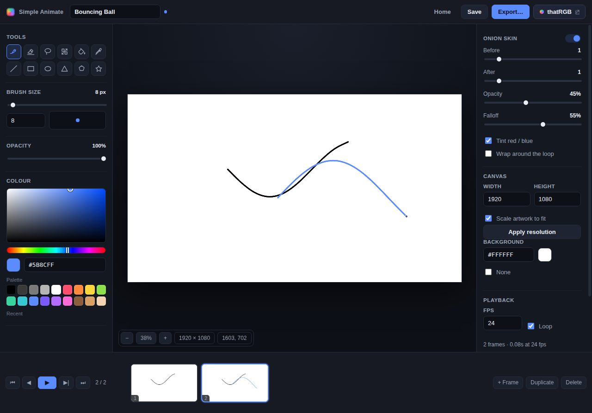
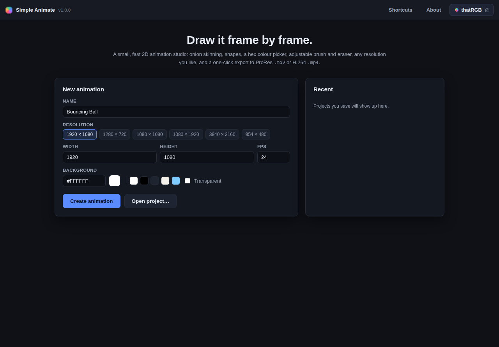
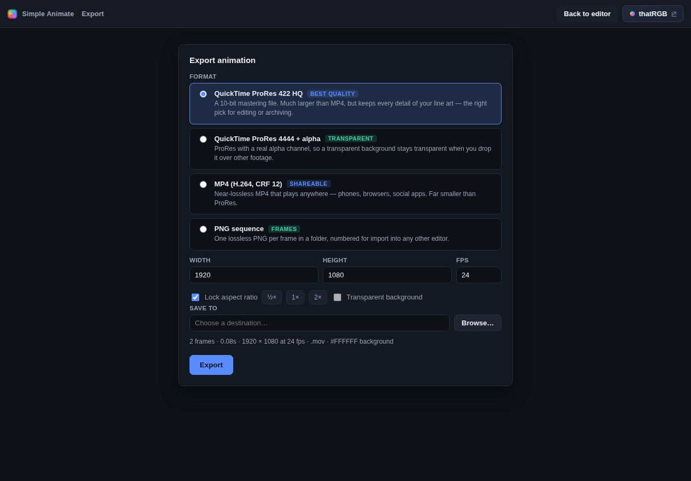

# Simple Animate

A small, fast **2D frame-by-frame animation studio** for Windows and macOS. Draw each
frame, flip through them with onion skinning, and export a real video file — no other
software required.



## Features

- **Adjustable onion skin** — any number of frames before and after (0–8 each), with
  opacity, per-frame falloff, red/blue tinting and optional wrap-around at the loop point.
- **Brush and eraser** with adjustable thickness (1–300 px) and opacity.
- **Shapes** — line, rectangle, ellipse, triangle, polygon and star, filled or outlined,
  with `Shift` to constrain and `Alt` to draw from the centre.
- **Lasso select** — circle any area to copy, cut, delete or drag it somewhere else, on the
  same frame or another one.
- **Stretch tool** — eight handles to scale a selection (or the whole frame); `Shift` keeps
  the proportions, `Alt` stretches from the centre.
- **Hex colour picker** — saturation/value field, hue slider, `#RRGGBB` entry, palette and
  recent swatches, plus an eyedropper and a paint bucket with adjustable tolerance.
- **Any resolution** — pick a preset or type your own, and resize the canvas at any time
  (with or without scaling the artwork).
- **Timeline** — add, duplicate, delete and drag-reorder frames, with live thumbnails and
  looping playback at your chosen frame rate.
- **Export** to ProRes `.mov`, H.264 `.mp4` or a PNG sequence — see below.
- A **thatRGB button in the top right of every page** opens
  [thatrgb.website](https://thatrgb.website/) in your browser.

| | |
| --- | --- |
|  |  |

## Export formats

ffmpeg is bundled with the app, so exporting works out of the box.

| Format | Container | Use it for |
| --- | --- | --- |
| **ProRes 422 HQ** | `.mov` | **Best quality.** A 10-bit mastering file — large, but keeps every detail. |
| **ProRes 4444** | `.mov` | Same quality *plus a real alpha channel* for transparent backgrounds. |
| **H.264, CRF 12** | `.mp4` | Near-lossless and plays everywhere — phones, browsers, social apps. |
| **PNG sequence** | folder | One lossless PNG per frame, numbered for import elsewhere. |

Frames are piped to the encoder as lossless PNG, so the only quality loss is whatever the
codec you pick introduces. ProRes `.mov` is the higher-quality option; MP4 is the portable
one.

## Install

Grab the installer for your platform from the
[Releases page](https://github.com/thatrgbgamer/simple-animate/releases):

- **Windows** — `Simple Animate-1.0.0-Windows-x64.exe` (installer) or the
  `-Windows-Portable.exe` build, which runs without installing.
- **macOS** — `Simple Animate-1.0.0-macOS-arm64.dmg` (Apple Silicon) or `-macOS-x64.dmg`
  (Intel).

> The builds are not code-signed. Windows SmartScreen shows "More info → Run anyway";
> on macOS, right-click the app and choose **Open** the first time, or run
> `xattr -dr com.apple.quarantine "/Applications/Simple Animate.app"`.

## Running from source

```bash
npm install     # also fetches the matching ffmpeg binary
npm start       # launch the app
npm run check   # parse every source file and verify the bundled encoder
```

### Building installers

Each installer has to be built on its own platform (electron-builder cannot make a macOS
`.dmg` on Windows or vice versa):

```bash
npm run dist:win    # on Windows → dist/*.exe
npm run dist:mac    # on macOS   → dist/*.dmg and *.zip
```

Pushing a `v*` tag runs `.github/workflows/build.yml`, which builds both platforms on
GitHub's runners and attaches the installers to a release. You can also trigger it by hand
from the Actions tab.

## Keyboard shortcuts

| | |
| --- | --- |
| Tools | `B` brush · `E` eraser · `V` lasso · `K` stretch · `G` bucket · `I` eyedropper |
| Shapes | `L` line · `R` rectangle · `O` ellipse · `T` triangle · `P` polygon · `S` star |
| Brush size | `[` and `]` |
| Frames | `,` and `.` to step · `Space` to play · `Ctrl/Cmd`+`D` duplicate |
| Selection | `Ctrl/Cmd`+`C` / `X` / `V` · `Enter` applies · `Esc` deselects |
| View | `Ctrl/Cmd` + `+` / `−` / `0` · wheel to zoom · middle or right drag to pan |
| File | `Ctrl/Cmd`+`N` / `O` / `S` · `Ctrl/Cmd`+`E` to export |

The in-app **Shortcuts** page lists them all.

## Project files

Animations are saved as `.sanim` files — JSON with one PNG-encoded frame per entry, so a
project is self-contained and easy to inspect.

## Layout

```
src/main/        Electron main process: window, menus, ffmpeg export pipeline
src/preload/     the single bridge the renderer is allowed to call
src/renderer/    the UI: editor, tools, selection, timeline, export view
build/           application icons
scripts/         icon generation and the source check
```

## Licence

MIT — see [LICENSE](LICENSE).
